# M-Bus gateway with web server based on ESP8266 NodeMCU

## Description
This device hosts a web server and an M-Bus gateway and allows to communicate with M-Bus consumption meters from a browser.
[M-Bus](https://m-bus.com/) is a standard for remote reading of consumption meters (e.g. water, heat, electricity meters, etc.). As of today, the standard is maintained by [OMS-Group](https://oms-group.org/en/), and evolved to support other device types, including sensors, detectors, controllers, etc.

## Features
* Allows to scan the M-Bus network for connected M-Bus devices (**Devices** tab on the web page).
* M-Bus gateway can have multiple consumption meters connected to the M-Bus network, and these M-Bus devices can be added/configured through the web interface;
* Ability to send raw commands via M-Bus (optionally enriched with a calculated checksum, and formatted into an M-Bus datagram) from the web interface (**M-Bus** on the web page);
* M-Bus capabilities are provided by the [tmbus library](https://github.com/dev-lab/tmbus) which is deployed on NodeMCU as part of the M-Bus gateway software. Check its capabilities online: [Live M-Bus datagram decoder](https://dev-lab.github.io/tmbus/tmbus.htm).

*The following features are derived from [the platform](https://github.com/dev-lab/bare-esp-iot-generic-switch) on which project is based*:

* Wi-Fi connection (such as setting up an access point, or using an existing Wi-Fi network) can be set up via the web interface;
* NodeMCU device hosts HTTP server locally, no third-party services are used and no Internet access is required;
* There is a built-in IDE for editing the software via the web interface (you can hack the software at runtime to add new features);
* Responsive Web UI (usable from smartphones);
* NodeMCU version agnostic (software can work on NodeMCU 1.5.4.1 - 3.0.0).

### Web UI overview:

#### UI overview:
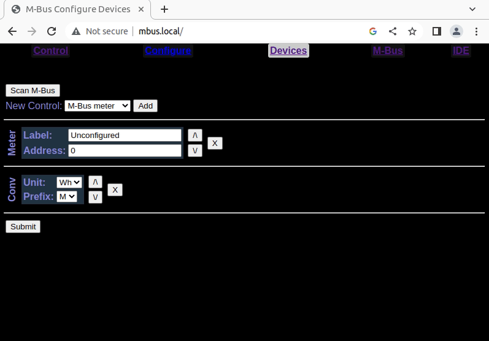

#### Setup Wi-Fi access point:
[](https://github.com/dev-lab/blob/blob/master/iot-power-strip/generic-switch-web-ui-config-wifi-ap.gif)

#### Setup `admin` authentication:
[](https://github.com/dev-lab/blob/blob/master/iot-power-strip/generic-switch-web-ui-config-admin-auth.gif)

## Hardware
### NodeMCU to M-Bus interface
Here is the schematic diagram of the device:

[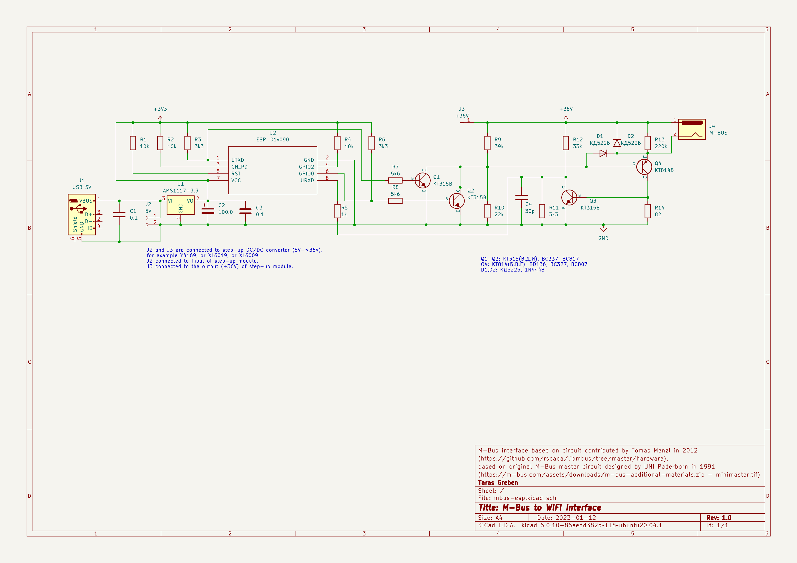](./images/mbus-wifi-schema.pdf)

The M-Bus interface based on a [circuit contributed by Tomas Menzl in 2012](https://github.com/rscada/libmbus/tree/master/hardware), which itself is based on the [original M-Bus master circuit designed by UNI Paderborn in 1991](https://m-bus.com/assets/downloads/m-bus-additional-materials.zip) (refer minimaster.tif there).
I have modified the circuit for my needs, as follows:
* The M-Bus interface is controlled by the ESP8266 (via UTXD and URXD pins). In addition, the GPIO0 pin controls Q2 to prevent startup debug information (sent from the ESP8266 via the TX pin) from leaking to the M-Bus network.
* D1 is added to prevent reverse base-emitter voltage breakdown. In my case each Q4 kept permanently degrading after about 2 weeks of use, so I lost two KT814Bs. But if you are not using vintage transistors of dubious quality, then you can do without D1.
* D2 is probably not needed if you wired M-Bus according to the M-Bus standard, but I pre-installed twisted pair (which is wrong) for the M-Bus network, and it looks like an inductive load to me, so I put D2 just in case.
* C4 (30pF) is added to improve readings reliability. Without it, I occasionally got incorrect readings, e.g. with checksum failed.

The circuit is powered by a 5V power supply (a standard 5V 1A micro-USB adapter from an old phone), so step-up DC/DC converter was used to get +36V. I used a Y4169 module, but any module (such as based on XL6019 or XL6009) capable of generating 36V DC from 5V DC should work. Just remember to adjust the module with a variable resistor to produce 36V DC from 5V.

### PCB
If you have the same ancient types of transistors (that haven't done anything on the shelves for many decades), you can use the old-school through-hole [hand-drawn] PCB I designed here:

[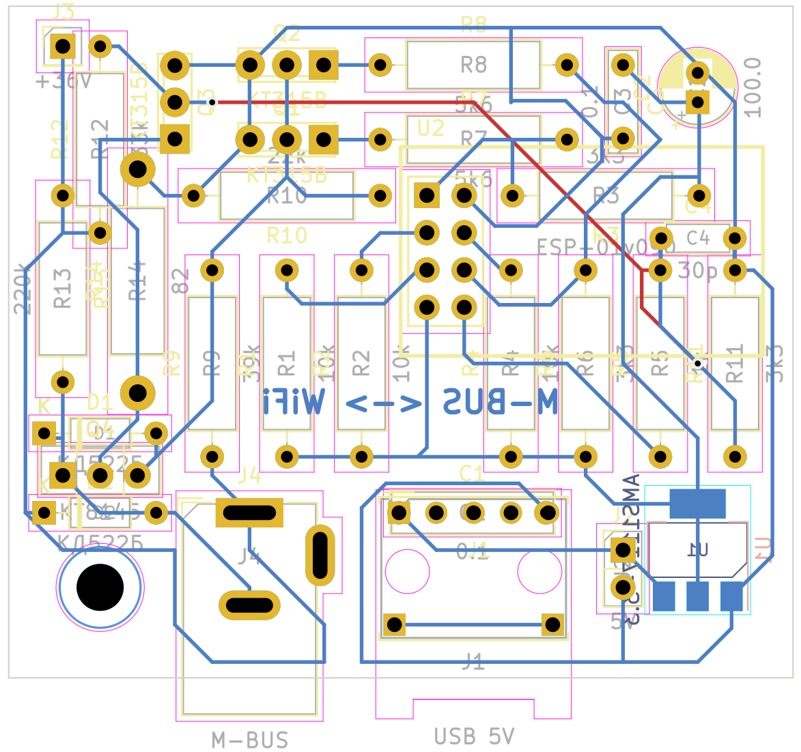](./images/mbus-wifi-components.pdf)

And here is the back side of the 1:1 PCB. It is useful for marking holes with a hammer and a center punch for drilling, and for hand drawing traces :-):

[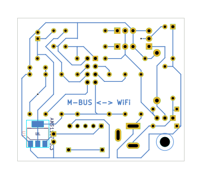](./images/mbus-wifi-back.pdf)

Here are 3D views of the components on the PCB (front and back, but without ESP-01, and without microUSB and M-Bus connectors):

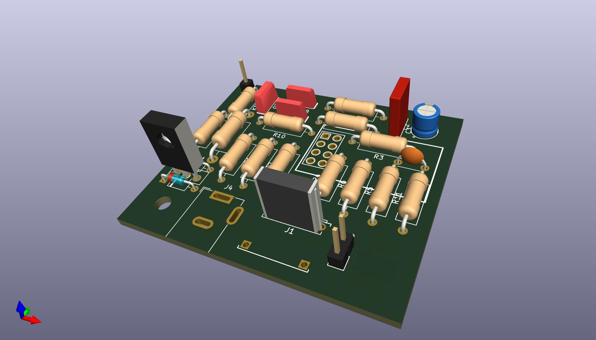

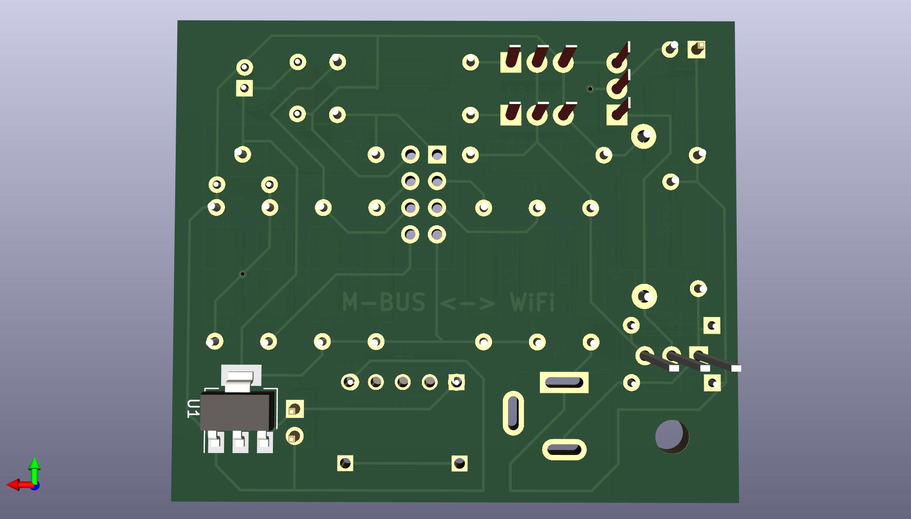


### Enclosure for PCB modules
The enclosure to house the M-Bus interface and Y4169 DC-DC converter modules can be 3D printed. It is posted on [Thingiverse](https://thingiverse.com), but also included [here](./enclosure/) ([bottom part](./enclosure/mbus-wifi-bottom.stl), [top part](./enclosure/mbus-wifi-top.stl)).
Below are a few images showing how the M-Bus gateway and step-up DC-DC converer are placed in the case.

Assembled, the bottom part is visible:

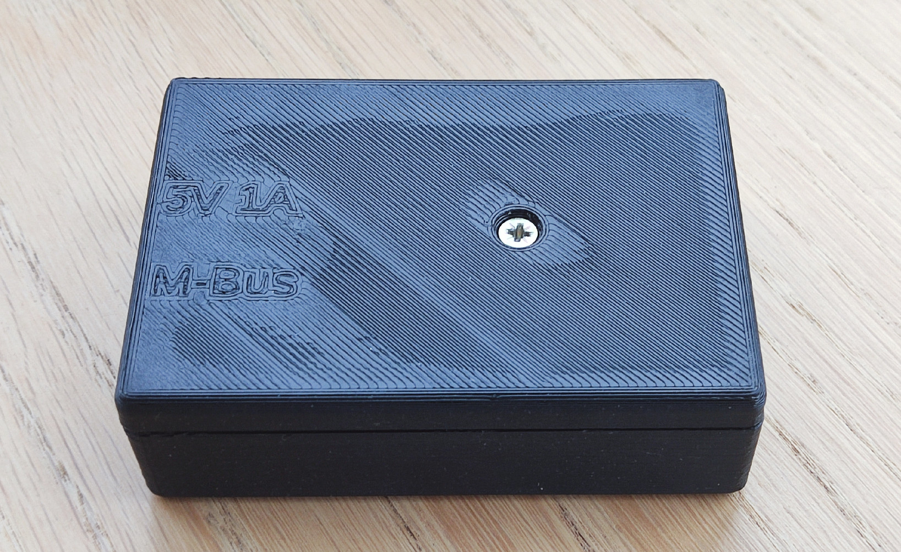

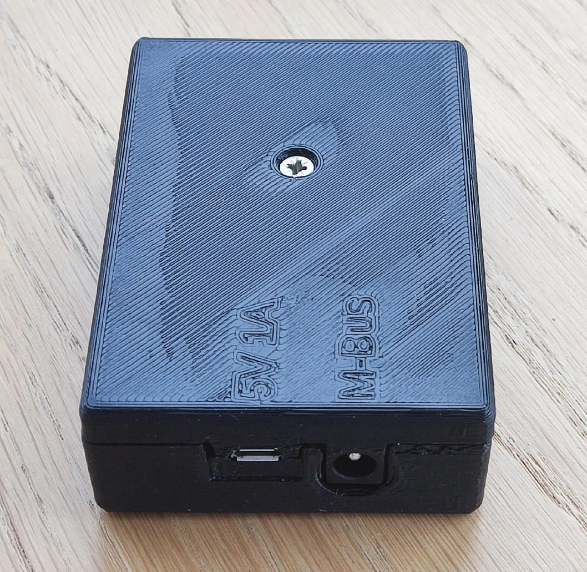

Assembled, the top part is visible:

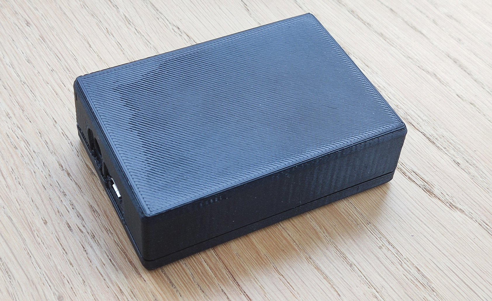

Disassembled:

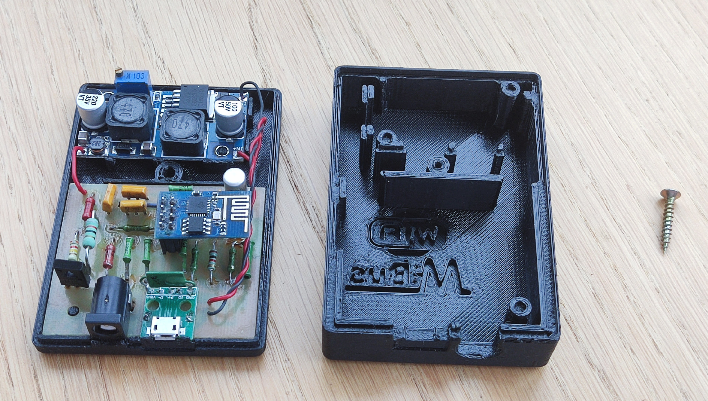

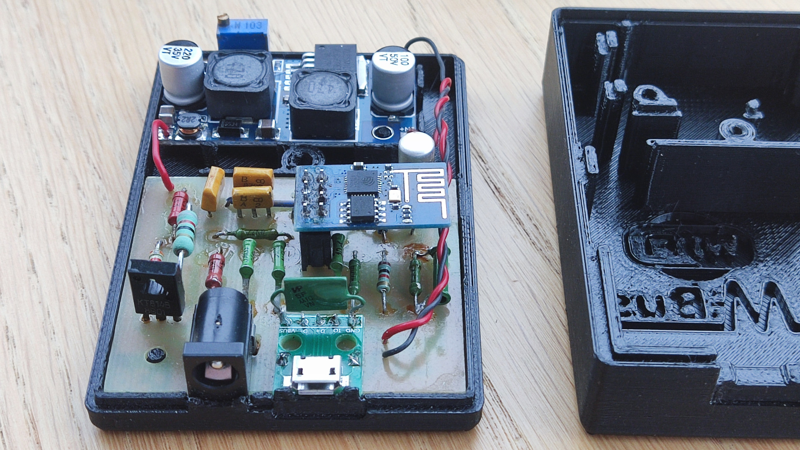

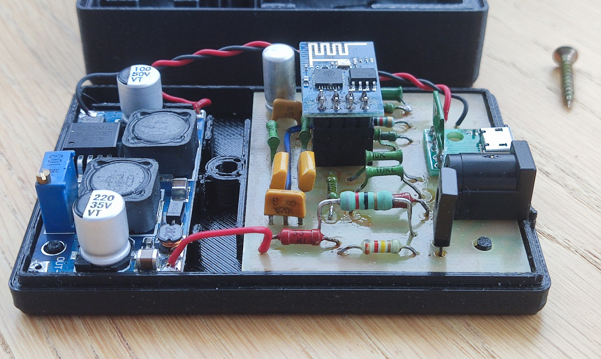

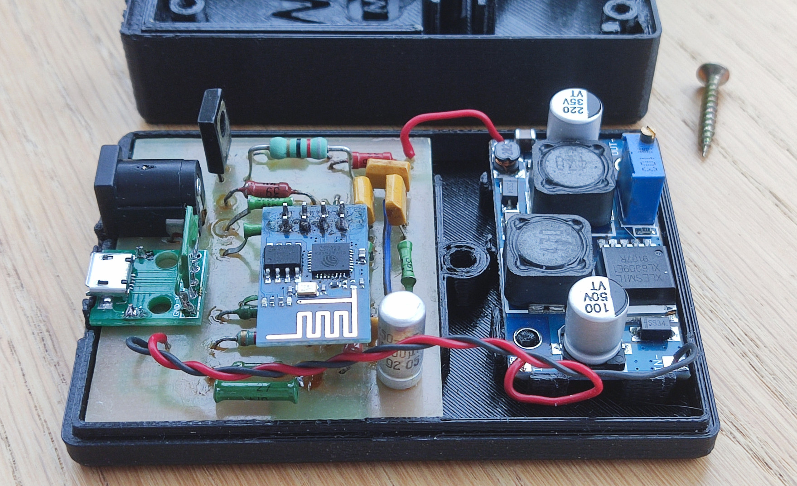

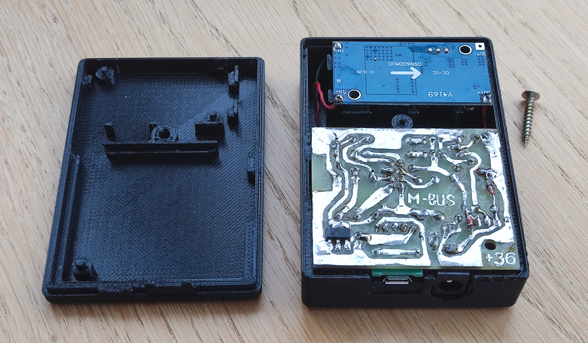

### Connection of M-Bus meters
All M-Bus devices must be connected in parallel to the M-Bus network (connector J4) according to the [schematic diagram](./images/mbus-wifi-schema.png) above, as shown on [M-Bus rev. 4.8 specification](https://m-bus.com/assets/downloads/MBDOC48.PDF), page 14, Fig.8:

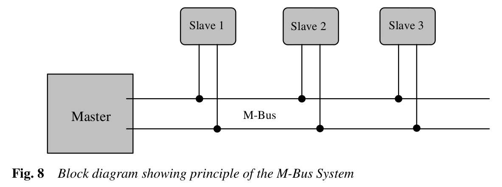

When connecting the device, polarity does not matter, but all meters must operate at the 2400 baud rate that is default for M-Bus. If the M-Bus devices (meters) do not yet have an M-Bus address assigned, connect them one at a time, [assign an M-Bus address](#assign-addresses-to-m-bus-meters) and repeat the procedure for the other devices.

## Setup

### Prepare NodeMCU software
1. Flash the ESP8266 module with the NodeMCU firmware as described in [Flashing the firmware](https://nodemcu.readthedocs.io/en/release/flash/) with any tool you like (e.g. [esptool](https://github.com/espressif/esptool), [NodeMCU Flasher](https://github.com/nodemcu/nodemcu-flasher) etc.). The custom NodeMCU firmware can be built online with the service: [NodeMCU custom builds](https://nodemcu-build.com/). If your ESP8266 EEPROM is only 512Kb (original ESP-01 module), you have to take extra steps to be sure that firmware is as small as possible, and there is enough space for project files in EEPROM file system. So, build your custom firmware based on 1.5.4.1-final NodeMCU with the only 9 modules selected: `cjson`, `encoder`, `file`, `gpio`, `net`, `node`, `tmr`, `uart`, `wifi`, no TLS, no debug, and take the integer version of it (its size is 398804 bytes in my case). In the case if your ESP module goes with larger EEPROM installed, you can build even the most recent NodeMCU version (select the `release` option on online build tool) with more modules selected, just make sure that at least 70Kb of file system space is available when you run NodeMCU. Make sure the following 9 modules are selected when you are building the firmware:
  * `encoder`;
  * `file`;
  * `GPIO`;
  * `net`;
  * `node`;
  * `SJSON` (for new NodeMCU; if you build older NodeMCU (1.5.4.1) select `cJSON` instead);
  * `timer`;
  * `UART`;
  * `WiFi`.
2. Upload the project files (all the files from [src/](src/) directory) to the ESP module (read the [Uploading code](https://nodemcu.readthedocs.io/en/release/upload/) how to do it). If you prefer, you can use the tool for uploading NodeMCU files from https://github.com/dev-lab/esp-nodemcu-lua-uploader. Upload the software with either [install.sh](install.sh), or [install.bat](install.bat) depending on your OS.
3. Restart the ESP8266 module (turn it off and turn back on). After restarting you will see a new Wi-Fi access point with the name: `esp-devlab-setup`. You will be able to connect to the module with the default password: `We1c0me!`. The default Wi-Fi AP name and password are specified in file: [`connect.lua`](./src/connect.lua).
4. On successful connection to the `esp-devlab-setup` Access Point you will be able to reach the Web UI through the browser by typing anything looking like domain name as an URL, e.g.: `any.site.my`. You can do that because the software starts a DNS liar server (it responds with the ESP8266 IP to any DNS request) in AP mode.
5. Web UI shall be quite self-explaining to use. You only have to remember that the best way to brick the software is to use Web IDE without checking twice what you are uploading to the file system. The changes are taken into account immediately. A bricked NodeMCU can be cured only with connecting of ESP module to computer through UART, formatting of NodeMCU file system, and rewriting the Lua software. In some cases you even have to re-flash the NodeMCU (e.g. if you did the mistake and removed the delay in [`init.lua`](./src/init.lua).

### Assign addresses to M-Bus meters
The primary M-Bus address defines the revipient to send commands to and can be any number between 1 to 250. All unconfigured devices are assigned an address of 0 by default. If you intend to connect more than one M-Bus device to the M-Bus server, you must assign them unique addresses.

#### M-Bus device address setting
1. First of all, you have to find out what the current address of the M-Bus device is. This step can be skipped if only one M-Bus device (consumption meter) is connected to the M-Bus server. In this case, you can use the `FE` (broadcast) address to send commands to it. If the M-Bus device has not yet been configured, it must be available at address `0` (unconfigured). But if it has been configured before (if the address has been assigned once, probably on a different M-Bus network), the easiest way is to scan the M-Bus network to find it. To scan devices in M-Bus, simply open the web interface, navigate to **Devices** tab, and click the "Scan M-Bus" button. The scan is a long process (it will take a few minutes) and if it find devices it will automatically add them to the configuration (although you need to submit this configuration to save it to the NodeMCU file system).
2. Assuming you find the address of the device you want to change, go to the **M-Bus** tab in the web interface and make sure the device responds to the "Initialization command" (M-Bus command SND_NKE, or `40` in hex). To execute the initialization command, simply enter `40` in the field followed by the M-Bus address in hexadecimal format (2 characters, e.g. `00` for address 0, `2a` for address 42, etc.). Then make sure the checkbox on the page is checked (to calculate the checksum and format the M-Bus datagram), and submit the command. If the device is available at the specified address, the command will return `E5` (RSP_ACK M-Bus datagram, or "reception of a valid acknowledge byte"). For example, to initialize a device with address 0, send `40 00`; to initialize the device with address 42 (2A in HEX), send: `40 2A'.
3. Then, once you've verified that the device responds at the address found, you can finally change its M-Bus address. According to the M-Bus specification, you must send the SND_UD command with CI Field `51`, DIF `01`, and VIF `7A` (all in hex). So enter the command (again in the **M-Bus** tab of the M-Bus server web page) using the following template:
	```
    53 <address found on previous steps> 51 01 7A <new address to be assigned>
	```
	For example to change the address to 42 ('2A' in hex) for a single device in the M-Bus network, send the following command:
    ```
    53 FE 51 01 7A 2A
    ```
    To assign address 1 to a new unconfigured device (with address 0), use this command:
    ```
    53 00 51 01 7A 01
    ```
    Needless to say, the checkbox for calculating checksum and M-Bus datagram formatting must be checked. After a successful transmission, the device will return `E5`.
4. Now you can verify that the device is responding at the newly assigned address. Just send SND_NKE M-Bus command (hex `40`) to check it. For example, if the device was assigned address 42 in the previous step, send the command: `40 2A` and if it responds with `E5`, the device is available at that address.
Here is a very long animation showing an M-Bus address change followed by an M-Bus network scan:


### Configuring M-Bus devices in the web interface
When all M-Bus devices in the network have unique addresses, they can be connected to the M-Bus gateway and configured in the [web interface](#ui-overview). Go to the **Devices** tab in the web interface and click the "Scan M-Bus" button to find all devices in the M-Bus network, or add them manually using the **Add** button (select "M-Bus meter" near the "Add" button and when a new device is added, assign it an M-Bus address). Each time you scan M-Bus devices or add them manually, assign them labels (they will appear on the **Control** page). The [animation above](./images/mbus-web-ui-assign-address.gif) shows how to do this.
You can also configure unit converters on the **Devices** tab. For example, if your meter provides **Wh**, but you want to see **MWh** in the interface instead, "Add" a "Unit Converter", select **Wh** Unit and **M** Prefix in the added control and submit the changes.

## Using
Navigate to the **Control** tab of the [web interface](#ui-overview), and it will request all configured meters to send their data to be displayed on the web page. This may take some time, depending on the number of configured M-Bus devices. Depending on your hardware, the data download may fail and you may see an error on the **Control** page. Just reload the page and it will most likely fix the problem. But in the case if the error appears several times, it most probably indicates a problem with the hardware.

## [License](./LICENSE)
Copyright (c) 2023 Taras Greben 

Licensed under the [Apache License](./LICENSE).
